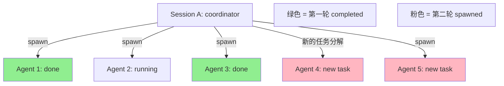

# jcode Swarm 使用问题记录

> 记录日期：2026-08-23

本文档记录在 jcode 项目中使用 Swarm 功能时遇到的问题和排查过程。

---

## 一、Swarm 面板切换按键问题：Alt+↑/↓失效根因与 workaround

### Alt+↑/↓ 在 Swarm 面板中无法选择 Agent

使用 Swarm 功能时，按下 Alt+↑ 或 Alt+↓ 无法切换到不同的 agent，反而被识别为滚动输入历史。但 Alt+N 能聚焦面板、Alt+O 能弹出到新终端，均正常工作。

### 代码调用链

按键输入从 `run` 函数开始（`crates/jcode-tui/src/tui/run.rs:340`），传递到 `handle_loop`，再到 `handle_tui_events`（`crates/jcode-tui/src/tui/app.rs:1873`）。最终到达 `handle_key_core`（第 2892 行），在 `handle_key_core` 之前，按键先经过 `handle_pre_control_shortcuts`（第 2264 行）。

`handle_key_core` 在第 2661 行遇到 Alt+↑/↓ 时通过 `is_prompt_recall_modifier` 判断触发输入历史翻滚：

```rust
if is_prompt_recall_modifier(modifiers, code) {
    app.toggle_prompt_recall(direction);
    return;
}
```

### 根因

Swarm 面板按键处理有严格的门控：

第 2352 行：
```rust
if app.swarm_panel_focused() && app.handle_swarm_panel_key(code, modifiers) {
    return true;
}
```
这里又有一层 `swarm_panel_focused()` 判断，加上 `inline_swarm_gallery_active()`（第 2077 行），双重门控。

按用户实际体验：Alt+N 能聚焦面板、Alt+O 能用，但 Alt+↑/↓ 不生效。这说明 `swarm_panel_focused` 已经是 true，门控不是问题。

### Alt+N 多按次的状态机

按用户实际观察：按一次 Alt+N 和连按两次的效果不同，两次会弹出更明显的窗口。这与 `cycle_swarm_panel_view`（第 2015 行）的状态机吻合：

```
当前状态                →  按 Alt+N 后状态
swarm_panel_focused=false → Controls（紧凑条带，显示在 status bar 上方）
swarm_panel_focused=true, full_page=false → FullPage（全屏页面）
swarm_panel_focused=true, full_page=true → Chat（退出面板）
```

两种模式（Controls 和 FullPage）都设置了 `swarm_panel_focused = true`。Alt+↑/↓ 在两种模式下都不可用（终端编码问题），Alt+j/Alt+k 在两种模式下都可用。

### 根因：终端对 Alt+Arrow 键的修饰符处理不一致

查看 `swarm_panel_action_for_key`（第 2176-2178 行）：

```rust
KeyCode::Down | KeyCode::Char('j') if alt => SelectNext,
KeyCode::Up | KeyCode::Char('k') if alt => SelectPrev,
KeyCode::Char('o') | KeyCode::Enter if alt => SelectPopOut,
```

Alt+↑/↓ 要求 `KeyCode::Up/Down` **且** `modifiers` 包含 `ALT`。但许多终端（手机终端、Win10 的多数终端）对 Alt+Arrow 的处理方式是发送 `ESC [ A` / `ESC [ B` 序列，而不是 `Char('o')|ALT`。crossterm 收到后解析为 `KeyCode::Up/Down` 但 **modifiers 为空**（ALT 已消耗在 ESC 前缀中），导致 `if alt` 判断为 false，快捷键不匹配。

Alt+ 字母键（如 Alt+O）走的是字符编码路径，不受此影响，所以 Alt+O 能正常工作。

### workaround：使用 Alt+j / Alt+k 替代

代码已经内置了字母替代键（第 2176-2177 行）：

| 功能 | 原快捷键 | 替代快捷键 | 状态 |
|------|---------|-----------|------|
| 选下一个 agent | Alt+↓ | **Alt+j** | ✅ 可用 |
| 选上一个 agent | Alt+↑ | **Alt+k** | ✅ 可用 |
| 弹出到新终端 | Alt+O | — | ✅ 可用 |
| 打开 swarm prompt | Alt+Shift+P | — | ✅ 可用 |

Alt+j/Alt+k 在 TUI 中没有被占用（仅在 Desktop2 中用作工作区切换）。

### 代码修复方向（待实现）

在 `swarm_panel_action_for_key` 中增加 Alt+Arrow 的 F-key 降级归一化，或在 crossterm event 解析层统一处理 Alt+Arrow 的修饰符丢失问题。

---

## 二、查看执行过的 Swarm 列表与重入已结束的 Agent

### 查看历史记录

**当前活跃 agent**：

- **TUI**：按 `Alt+N` 进入 Swarm 面板，可以看到实时状态图（running/blocked/idle）
- **Agent 内部工具**：使用 `swarm list` 内部 API 调用
- **语言指令**：在 TUI 中说"列出所有代理"，模型自动调用 `swarm list`

仅显示 running / idle 状态的 agent。

**已结束 agent 的历史**：

| 方式 | 用途 |
|------|------|
| `session_search query=swarm` | 搜索所有 swarm 相关会话，包括已完成的 worker |
| coordinator 会话对话历史 | 每个 worker 完成后自动转发 completion report 给 coordinator |
| `Alt+N` 进入 Swarm 面板（TUI） | 实时状态图（running/blocked/idle），但不显示已清理的 completed |
| "告诉我 xxx 的状态" | 语言指令触发 `swarm status` |

### 重入已结束的 Agent

根据 `docs/SWARM_ARCHITECTURE.md` Communication 章节：**Completed 或 idle 的 agent 不会自动 resume**，必须显式操作。

#### 可用方法对比

| 方法 | 用途 | 执行方式 | 权限要求 |
|------|------|----------|----------|
| `Alt+j/k` + 输入指令 | TUI 内切换到 agent 并发送新消息 | TUI 快捷键，最推荐 | 无 |
| `jcode debug -S <id> message` | CLI 发送消息到指定 session | 需要先设置 `JCODE_DEBUG_CONTROL=1` | admin |
| "给 xxx 发消息继续工作" | 语言指令触发 `dm` / `message` | TUI 自然语言 | 任意成员 |
| "唤醒 idle 的 xxx" | 语言指令触发 `wake` | TUI 自然语言 | 建议 coordinator |
| "重新分配这个任务给另一个代理" | 语言指令触发 `reassign` | TUI 自然语言 | 需 coordinator |
| `swarm assign_task` | coordinator 分配新任务给该 agent | 通过 coordinator 界面或 `swarm assign` 命令 | coordinator |
| `swarm retry` | 对失败的 agent 重新分配同一任务 | 通过 failure report 自动触发或手动 `swarm retry` | coordinator |
| `swarm spawn` | 重新 spawn 一个全新的（不重入旧的） | `swarm spawn` 或 `jcode self-dev` 重新启动 | 无 |

#### 具体操作流程

**TUI 方式（推荐）**：
1. 按 `Alt+N` 进入 Swarm 面板
2. 使用 `Alt+j` 或 `Alt+k` 导航到目标 agent
3. 直接输入新指令即可

**CLI 方式（仅限调试场景）**：
```bash
# 前提条件：设置环境变量启用 debug socket
export JCODE_DEBUG_CONTROL=1

# 1. 启动 server（如果未运行）
jcode debug start

# 2. 查看 session 列表获取 agent ID
jcode debug list

# 3. 发送消息到指定 session
jcode debug -S <agent_session_id> message "新指令"
```

注意：CLI 命令仅用于调试，生产环境请使用 TUI。

注意：`jcode` 没有独立的 `swarm` shell 子命令。上述 `swarm list`、`swarm message` 等是**Agent 内部工具 API**，不在 CLI 层面暴露。

**重要提示**：如果 agent 已被 `cleanup` 清理（停止），则无法重入，只能 `spawn` 重新创建。

---
## 三、Swarm 工具 Action 触发方式（2026-08-23 15:53:40 追加）

### 核心机制：自然语言指令 → 模型自动调用 swarm 工具

根据 `260822-swarm.md` 第五节，swarm 工具提供 35+ 个 action（spawn、dm、broadcast、assign_task、await_members 等）。用户在 **TUI 外部** 如何触发这些 action？

#### 答案：直接告诉模型"想做什么"，模型自动选择对应 action

| 用户说 | 模型内部调用 |
|---------|-------------|
| "生成一个代理审查 api.rs" | `swarm { action: "spawn", label: "...", prompt: "..." }` |
| "给 api reviewer 发消息补充边界情况" | `swarm { action: "dm", to_session: "...", message: "..." }` |
| "等所有代理完成后汇总结果" | `swarm { action: "await_members", mode: "all" }` |
| "清理已完成的代理" | `swarm { action: "cleanup" }` |

#### 关键要点

1. **用户无需记住具体 action 名**：只描述意图，模型自己决定调用哪个 action
2. **没有 CLI 命令暴露这些 action**：必须通过对话触发
3. **TUI 有快捷入口但有限**：`Alt+N` 面板 + `Alt+j/k` 导航是最高效的直接操作
4. **设置 `/effort swarm` 后模型更主动**：会自主 decompose 任务并 spawn 多个代理

#### 两种触发模式

| 模式 | 触发方式 | 适用场景 |
|------|---------|----------|
| **显式手动** | 直接指示："spawn 3 个代理分别做 X/Y/Z" | 明确知道要并行做什么 |
| **隐式自动** | `/effort swarm` + "重构模块 A" | 让模型自主分解并行 |

**示例对比**：

```text
# 显式：用户指定结构
"并行生成 3 个代理：
 1) api reviewer 审查接口
 2) test writer 写单元测试
 3) doc updater 更新文档
 等全部完成"
↓ 模型依次调用 spawn×3 + await_members

# 隐式：模型自主决策  
/effort swarm
"重构 src/parser.rs，拆成三个独立模块"
↓ 模型判断需要 3 个 agent，自行 spawn 并分配任务
```

注意：无论哪种模式，最终都是模型调用 swarm 工具的某个 action。区别在于前者由用户指定结构，后者由模型基于系统提示自主决策。

### Swarm 历史轮次查看与重入（补充说明）

jcode 区分两种"历史"概念：

#### A. 会话级切换（不同 jcode 窗口/会话）

| 操作 | 语言指令示例 | 实际效果 |
|------|-------------|----------|
| 列出所有历史会话 | "列出我之前运行过的会话" | 触发 `/resume` 会话选择器 |
| 切换到某个会话 | "我想回到 api reviewer 的对话" | `/resume` 后选择对应 session |
| 查看活跃会话状态 | "哪些会话还在运行？" | `/active` 管理器 |
| 查看待处理会话 | "还有哪些待处理的？" | `/catchup` 选择器 |

**核心命令**：
- `/resume` — 打开会话选择器（最常用）
- `/active` — 管理 working vs ready 状态的会话
- `/catchup` — 查看挂起的会话

#### B. Swarm 内部 Agent 轮次

| 场景 | 能否重入 | 方法 |
|------|---------|------|
| 已完成但未 cleanup 的 agent | ✅ 可以 | TUI: `Alt+N` → `Alt+j/k` 选择 → 输入新指令<br>语言："给 test writer 发消息继续写测试" |
| 已被 cleanup 的 agent | ❌ 无法直接恢复 | 只能通过 `session_search query="test writer"` 搜索全局历史 |
| 正在运行的 agent | ✅ 可中断追加 | `/poke` 或直接向 coordinator 描述要追加的任务 |

**关键区别**：
- `/resume`、`/active`、`/catchup` 是**Jcode 内置 slash command**，直接输入即可，无需自然语言
- swarm action（list/dm/wake 等）必须通过**自然语言描述意图**，由模型自动调用对应 tool
- 被 `cleanup` 的 agent 永久无法重入，只能从全局搜索中找记录

---

## 四、Swarm 生命周期与多轮管理（2026-08-23 16:11 追加）

### 关键问题回答

#### Q1: Agent 什么时候被 cleanup？

| 场景 | 是否自动清理 | 说明 |
|------|-------------|------|
| **完成任务进入 idle** | ❌ **不自动清理** | agent 保留在 swarm 中，可以重入 |
| **显式调用 `swarm cleanup`** | ✅ 立即清理 | coordinator 主动清理 completed/idle 代理释放槽位 |
| **`run_plan` 默认行为** | ⚠️ **默认清理** | `run_plan` 的 `retain_agents=false` 时，完成节点后自动停止工作者 |
| **`run_plan retain_agents=true`** | ❌ 不清理 | 明确保留已完成的工作者 |
| **会话退出/jcode 关闭** | ❓ 取决于实现 | 需验证，理论上 server 持久化会保留 session |

**核心结论**：**Completed/idle 的 agent 不会被服务器自动清理**。必须显式调用 `swarm cleanup` 或在 `run_plan` 中设置 `retain_agents=false`。

#### Q2: 上一轮 swarm 未被清理前，能开新一轮吗？

**答：可以的，但要注意概念区分。**

jcode 的 swarm 设计是**基于工作目录的单一共享空间**：



**关键机制**：
- 同一仓库下的所有 jcode 会话共享同一个 `swarm_id`
- **不存在"上一轮/下一轮"的分隔**：所有 agent 都在同一个 swarm 中
- 已完成的 agent 标记为 `completed/idle`，新 spawn 的 agent 标记为 `running`
- 可以通过状态过滤查看不同批次的 agent

#### Q3: 新一轮开始后，如何回到上一轮的 agent？

**方法 1：TUI 面板选择（推荐）**
```
Alt+N → 进入 Swarm 面板
Alt+j/k → 导航到目标 agent（无论它是哪一轮的）
直接输入指令继续工作
```

**方法 2：语言指令指定**
```text
用户："给 api reviewer 发消息，它审查完接口了吗？"
↓ 模型识别 session label，自动调用 dm
```

**方法 3：通过 session_id 精准定位**
```bash
# 先在协调器会话中查询
用户："列出所有 completed 状态的代理及其 session_id"
# 获取具体 ID 后
用户："向 session_xxx 发送消息..."
```

#### Q4: Alt+N 等操作能对"上一轮"swarm 做操作吗？

**答：能！因为根本不存在"上一轮"的概念。**

Alt+N 显示的是**当前 swarm_id 下的所有成员**，包括：
- 正在运行的（running/blocked）
- 已完成但存活的（completed/idle）
- 刚 spawn 的新 agent

```
┌─ Swarm Panel (Alt+N) ───────────────────────┐
│ 🔴 hibiscus (running) - test_writer         │
│ 🟢 blossom (completed) - api_reviewer ✓     │ ← 上一轮 agent，可直接唤醒
│ 🔵 clover (coordinator)                     │
│ 🟣 daisy (idle) - doc_updater               │ ← 可重新分配任务
│                                              │
│ 按 Alt+j/k 选择，Esc 退出                    │
└──────────────────────────────────────────────┘
```

### 最佳实践总结

| 需求 | 推荐做法 |
|------|---------|
| **保留 completed agent 以便重用** | 不调用 `cleanup`；`run_plan` 设 `retain_agents=true` |
| **释放槽位给新任务** | 显式 `swarm cleanup` 只清理 completed/idle |
| **跨批次管理 agent** | TUI: `Alt+N` 看到全部<br>语言："告诉我为啥 batch 的 agent 还在运行" |
| **避免 slot exhaustion** | 定期清理长期 idle 的 agent；注意并发预算限制 |

### 常见误区

❌ **错误认知**："上一轮 swarm 已结束，新一代会覆盖旧的"
✅ **实际情况**：所有 agent 共存于同一 swarm，除非显式 cleanup

❌ **错误认知**："需要特殊的命令切换到历史轮次"
✅ **实际情况**：`Alt+N` 显示的就是全部，用 `/resume` 才是切换 jcode 会话窗口

❌ **错误认知**："agent 完成后会自动消失"
✅ **实际情况**：completed agent 永久保留直到被 cleanup

---

### `retain_agents=true` 正确设置方法（补充）

**不是配置文件设置！** `retain_agents` 是 `run_plan` 工具的运行时参数，默认值为 `false`。

#### 通过自然语言传递

```text
# ❌ 错误：只说"运行计划"，默认清理工作者
用户："帮我运行这个 swarm 计划"
→ 模型调用 swarm { action: "run_plan" } (没有 retain_agents，默认 false)

# ✅ 正确：明确要求保留工作者
用户："运行计划并保留完成后工作者，我不需要它们被自动清理"
→ 模型调用 swarm { action: "run_plan", retain_agents: true }

# 或直接指定参数
用户："执行 run_plan，设置 retain_agents=true"
→ 模型识别参数名并传递
```

#### 为什么默认是 `false`？

根据代码注释 (`crates/jcode-app-core/src/tool/communicate.rs:1249`)：
- Task-DAG 模型假设每个节点由独立的工作者处理
- 重用已完成其他节点的 worker 会把之前的对话上下文带入新任务
- 模型往往只是重复报告之前结果而不是做新工作
- 因此 `run_plan` 默认每节点 spawn 新 worker，完成即停止以释放 slot

#### 什么时候设 `true`？

| 场景 | 推荐 |
|------|-----|
| 想让 completed workers 可重入追加任务 | `retain_agents=true` |
| 需要频繁查询历史 agent 状态 | `retain_agents=true` |
| 机器资源充足，slot 预算充足 | `retain_agents=true` |
| 长期运行多轮次、避免重复 spawn | `retain_agents=true` |
| **默认场景** | `retain_agents=false` (节省资源) |

---

---

## 五、TUI 状态提示说明（2026-08-23 16:23 追加）

### "Swarm view closed" 什么时候出现？

**场景**：从 FullPage 模式按 Alt+N 退出时

#### 完整状态流转与对应提示

| 当前状态 | 按 Alt+N 后 | 底部状态栏提示 |
|---------|------------|---------------|
| Chat（普通聊天） | → Controls | "Use Alt+↑/↓ to select, Alt+O to open, Esc to exit" |
| Controls（紧凑条带） | → FullPage | "Swarm panel (full page): Use ↑/↓ to navigate, Enter to focus, Esc to close" |
| **FullPage（全屏页面）** | → **Chat** | **"Swarm view closed"** ← 你看到的就是这个 |

#### 代码位置验证

`crates/jcode-tui/src/tui/app/input.rs:2337-2345`:

```rust
match app.cycle_swarm_panel_view() {
    SwarmPanelView::Chat => {
        app.set_status_notice("Swarm view closed");
    }
    SwarmPanelView::Controls => {
        app.set_status_notice(crate::tui::keybind::swarm_view_hint("full page"));
    }
    SwarmPanelView::FullPage => {
        app.set_status_notice(crate::tui::keybind::swarm_page_hint());
    }
}
```

#### 实用技巧

如果你想停留在某个视图而不继续循环：

| 想要停留的状态 | 操作 |
|--------------|------|
| 只打开紧凑条带看状态 | 按一次 Alt+N → 用 Esc 退出 |
| 查看全屏详情 | 按一次 Alt+N → 再按一次 Alt+N → 用 Esc 或第三次 Alt+N 退出 |
| 直接关闭 swarm 面板 | 在任何面板模式下按 Esc |

---

#### 异常边界情况：无 Swarm Agent 时按 Alt+N

**问题现象**：当前没有任何 swarm agent 时，按 Alt+N 会立即显示 "Swarm view closed"。

**根本原因**：

查看代码 `crates/jcode-tui/src/tui/app/tui_state.rs:2015-2020`:

```rust
pub(crate) fn cycle_swarm_panel_view(&mut self) -> SwarmPanelView {
    // 🔴 关键检查：如果 inline gallery 不活跃（无可用成员）
    if !self.inline_swarm_gallery_active() {
        self.swarm_panel_focused = false;
        self.swarm_panel_full_page = false;
        return SwarmPanelView::Chat;  // ← 直接返回 Chat，从未真正打开面板
    }
    // ... 正常状态循环逻辑
}
```

`inline_swarm_gallery_active()` 检查当前是否有可用的 swarm members。如果没有：
- 函数**短路返回** Chat
- input.rs 匹配到 Chat 分支显示 "Swarm view closed"
- **实际上面板根本没机会打开**

**体验问题**：
| 用户预期 | 实际表现 |
|---------|---------|
| "我想看看有没有 agent" | "Swarm view closed"（好像刚才开过了？） |
| 应该提示"暂无 agent"或什么都不说 | 误导性的"已关闭"提示 |

**临时 workaround**：
```text
方法 1：先用语言查询
用户："告诉我 swarm 里有哪些代理"
→ 如果有，模型返回列表；如果没有，明确告知"当前没有活跃的 swarm 代理"

方法 2：先 spawn 再查看
用户："生成一个测试代理"
Alt+N  → 现在可以看到面板了
```

**建议改进方向**（非实现）：
- 当 `!inline_swarm_gallery_active()` 时，应设置空提示或不设置提示，而非 "Swarm view closed"
- 或者显示更有意义的提示如 "No active swarm agents to display"

---

## 六、Swarm Worker 图标与名字自定义（2026-08-24 01:19 追加）

### 能自定义的

**`label`（任务标签）**：`spawn` 时传 `label` 参数，显示在 agent 的 chip 上：

```text
# 用户说：
"生成一个代理，label='api reviewer'，审查 api.rs"

# 模型内部调用：
swarm { action: "spawn", label: "api reviewer", prompt: "审查 api.rs" }
```

### 不能自定义的

| 项目 | 原因 |
|------|------|
| **随机名字**（hibiscus / blossom） | session ID 由 `new_memorable_session_id_avoiding()` 生成，硬编码随机 |
| **图标/emoji** | 状态图标固定映射（`▶`=running, `✓`=completed, `✗`=failed 等），不可配置 |
| **friendly_name** | 没有 exposed 给用户设置，仅供内部使用 |

### 实际显示效果

| 你看到的 | 来源 |
|---------|------|
| `hibiscus` | session ID 随机名 |
| `api reviewer` | `label` 参数 |
| `▶` / `✓` 等状态图标 | 根据 status 自动映射 |

**总结**：只能通过 `label` 参数指定任务名，随机名字和图标都是自动生成的，无法自定义。

---

---

## 七、`retain_agents=true` 无效原因分析（2026-08-24 01:22 追加）

### 问题现象

设置 `retain_agents=true` 后，任务执行完进入 idle，但 worker 仍然被释放（约 10-30 分钟）。

### 根本原因

**`retain_agents` 只控制 `run_plan` 的行为**，worker 被释放是**三条独立机制**共同作用的结果，其中两条完全不受 `retain_agents` 控制。

### 三条独立回收路径（2026-08-24 07:17 走查修正）

| # | 机制 | 代码位置 | 触发时机 | 受控于 |
|---|------|---------|---------|--------|
| 1 | **Idle worker reaper** | `server.rs:211` → `swarm.rs:257` | ready/terminal 成员空闲超时（默认 30min） | `JCODE_SWARM_IDLE_WORKER_REAP_SECS`（0=禁用） |
| 2 | **客户端断开清理** | `client_disconnect_cleanup.rs:54` | 客户端连接断开后**立即**清理 | ❌ **不受任何 env 控制** |
| 3 | **terminal 成员 GC** | `server.rs:133` → `swarm.rs:192` | terminal 状态超期（默认 24h） | `JCODE_SWARM_TERMINAL_MEMBER_RETENTION_SECS` |

### 路径 1：Idle Worker Reaper（可配置，但注意生效对象）

`crates/jcode-app-core/src/server/swarm.rs:257-291`:

```rust
const DEFAULT_SWARM_IDLE_WORKER_REAP_SECS: u64 = 30 * 60;

pub(super) fn swarm_idle_worker_reap_after() -> Option<Duration> {
    let secs = std::env::var("JCODE_SWARM_IDLE_WORKER_REAP_SECS")
        .ok()
        .and_then(|value| value.trim().parse::<u64>().ok())
        .unwrap_or(DEFAULT_SWARM_IDLE_WORKER_REAP_SECS);
    (secs > 0).then(|| Duration::from_secs(secs))
}
```

回收条件（`idle_spawned_worker_reap_candidates`）：
1. `report_back_to_session_id.is_some()` — 被 spawn 的工作者
2. `role != "coordinator"` — 不是协调器
3. `status == "ready" || terminal_status` — 已完成工作
4. `last_status_change.elapsed() >= idle_after` — 空闲超过阈值

**⚠️ 关键坑：环境变量要在 server daemon 进程里生效**

`std::env::var` 读取的是 **daemon 进程**（`~/.jcode/builds/shared-server/jcode`）的环境。只在 TUI 的 shell `export` 没用：

```bash
# ❌ 无效：只影响当前 shell，daemon 进程读不到
export JCODE_SWARM_IDLE_WORKER_REAP_SECS=0

# ✅ 正确：daemon 启动前设置 + 重启 daemon
JCODE_SWARM_IDLE_WORKER_REAP_SECS=0 jcode serve
# 或通过 self-dev 重启 shared daemon 后生效
```

### 路径 2：客户端断开清理（真正拦不住的）

`crates/jcode-app-core/src/server/client_disconnect_cleanup.rs:54-206`：

worker 的客户端连接一旦断开（visible 窗口被关、headless 客户端退出），`cleanup_client_connection` 会**无视任何时间配置立即执行**：

```rust
// 第 182-202 行：标记成员为 terminal
let (status, detail) = match disposition {
    DisconnectDisposition::Closed => ("stopped", Some("disconnected".to_string())),
    ...
};
update_member_status(client_session_id, status, detail, ...).await;

// 第 204-211 行：直接从 swarm_members map 移除
let mut members = swarm_members.write().await;
if let Some(member) = members.remove(client_session_id) { ... }
```

**结论**：这条路径不受 `JCODE_SWARM_IDLE_WORKER_REAP_SECS`、`retain_agents` 的任何控制。一旦 worker 的客户端连接断开，立即被移除。

### 路径 3：感知层干扰（15 分钟广播保留）

`DEFAULT_SWARM_STATUS_BROADCAST_TERMINAL_SECS = 15 * 60`（`swarm.rs:101`）：terminal 成员在**实时状态广播**中只保留 15 分钟，之后从 UI/面板中消失。

**你可能看到的"10 分钟释放"其实是这条**：成员还在服务器里（24h 保留期可查），只是面板上不显示了。

### 正确保留 worker 的组合方案

```bash
# 1. daemon 启动前设置（三选一或组合）
JCODE_SWARM_IDLE_WORKER_REAP_SECS=0 \
JCODE_SWARM_TERMINAL_MEMBER_RETENTION_SECS=86400 \
jcode serve

# 2. run_plan 时传 retain_agents=true（语言指令）
"执行 run_plan，保留完成后的工作者"

# 3. 避免关闭 worker 的客户端窗口（路线 2 的触发条件）
```

**仍然拦不住**：客户端断开清理（路径 2）。要避免它，只能保证 worker 的客户端连接不断开。


---

## 八、Worker 回收机制全路径分析（2026-08-24 11:33 多维走查）

### 问题现象

设置 `JCODE_SWARM_IDLE_WORKER_REAP_SECS=0` 或较长的时间后，worker 仍未到设定时间就被释放（观察约 10-30 分钟）。

### 核心结论

**"设置 reaper 超时"只能拦住一条路径**。worker 被回收由 **5 个维度、至少 7 条路径**共同决定，其中多条完全不受该 env 控制。

### 全路径清单

#### 维度 A：成员移除层（swarm.rs）

| # | 路径 | 代码位置 | 触发时机 | 控制项 |
|---|------|---------|---------|--------|
| A1 | Idle worker reaper | `server.rs:211` → `swarm.rs:257` | ready/terminal 成员空闲超时（默认 30min） | `JCODE_SWARM_IDLE_WORKER_REAP_SECS`（0=禁用） |
| A2 | Terminal 成员 GC | `server.rs:133` → `swarm.rs:192` | terminal 状态超期（默认 24h） | `JCODE_SWARM_TERMINAL_MEMBER_RETENTION_SECS` |

#### 维度 B：客户端连接层（不受 reaper 控制）

| # | 路径 | 代码位置 | 触发时机 | 控制项 |
|---|------|---------|---------|--------|
| B1 | **客户端断开清理** | `client_disconnect_cleanup.rs:54` | 客户端断开 → **立即**标记 terminal + 从 `swarm_members` 移除 | ❌ 完全不受控 |

#### 维度 C：run_plan 工具层（之前被低估）

| # | 路径 | 代码位置 | 触发时机 | 控制项 |
|---|------|---------|---------|--------|
| C1 | run_plan 结束清理 | `communicate.rs`（run_plan 尾部） | 计划结束，`retain_agents=false` | ✅ run_plan 参数 |
| C2 | **run_plan 中途容量恢复** | `communicate.rs:370` `cleanup_finished_workers_for_capacity` | **活跃成员达上限（默认 32）→ 立即停掉已完成 worker 释放槽位** | ⚠️ 只受 `swarm_max_concurrent_agents` 影响 |

> **C2 关键**：一旦 swarm 活跃成员数达 `swarm_max_concurrent_agents`（默认 32），容量恢复会**不等 reaper、无视 retain_agents**，立即停止刚 idle 的 worker。设置 reaper 时间再长也没用——这不是 idle 超时，是"容量不够先清人"。

#### 维度 D：服务器生命周期层（全新发现）

| # | 路径 | 代码位置 | 触发时机 | 控制项 |
|---|------|---------|---------|--------|
| D1 | **临时服务器 idle 超时** | `lifecycle.rs:138` | 临时服务器无客户端 30min → **整个 server 关闭** | `JCODE_TEMP_SERVER_IDLE_SECS`（默认 30min） |
| | | | ⚠️ **该模式仅通过环境变量手动开启**（`JCODE_TEMP_SERVER=1`），`configure_temporary_server` 从未被代码调用，默认 `jcode` 二进制不会触发此路径 |
| D2 | daemon reload/重启 | `reload.rs` | 重启导致客户端断开 → 走 B1 | ⚠️ 间接 |

> **D1 关键**：计时从**服务器**最后一次有客户端开始，不是从 worker idle 开始。但此模式仅通过手动设置环境变量开启（`JCODE_TEMP_SERVER=1`），默认 `jcode` 二进制不会触发。`configure_temporary_server` 函数虽然 pub 导出但从未被任何代码调用，属于**dead code**。

#### 维度 E：感知层（假象）

| # | 路径 | 代码位置 | 触发时机 |
|---|------|---------|---------|
| E1 | **广播保留 15min** | `swarm.rs:101` | terminal 成员只在实时广播保留 15 分钟，之后从面板消失，**但成员还在 24h 保留期可查** |

### 代码证据

**C2（容量恢复）**：`crates/jcode-app-core/src/tool/communicate.rs:370`：

```rust
/// Free swarm member capacity mid-run by stopping finished workers owned by
/// this coordinator. `run_plan` spawns a fresh worker per node by default and
/// normally cleans up only at the end of the run, so on large plans membership
/// grows monotonically toward the swarm member cap and fresh spawns start
/// getting refused.
async fn cleanup_finished_workers_for_capacity(...) {
    let candidates = cleanup_candidate_session_ids(...);  // 刚 idle 的 worker
    ...
    let outcome = stop_swarm_sessions(ctx, candidates, false).await;  // 直接停
}
```

**D1（临时服务器 idle）**：`crates/jcode-app-core/src/server/lifecycle.rs:11`：

```rust
const DEFAULT_TEMP_IDLE_SECS: u64 = 30 * 60;
// ... 无客户端 idle_since.elapsed() >= policy.idle_timeout_secs 时
shutdown_temporary_server(&server_name, &socket_path, &debug_socket_path).await;
```

⚠️ **此模式需要手动设置环境变量 `JCODE_TEMP_SERVER=1` 才启用**。`configure_temporary_server()` 函数虽然 pub 导出但从未被代码调用，是 dead code。默认 `jcode` 二进制（共享 daemon）不会触发此路径。

### 各路径的"可控性"总表

| 你想做的 | 能否达成 |
|---------|---------|
| 禁掉 idle reaper | ✅ A1：`JCODE_SWARM_IDLE_WORKER_REAP_SECS=0`（daemon 启动前设置） |
| 禁掉 terminal GC | ✅ A2：`JCODE_SWARM_TERMINAL_MEMBER_RETENTION_SECS=86400` |
| run_plan 结束后保留 worker | ✅ C1：`retain_agents=true` |
| 防止容量恢复提前清人 | ⚠️ C2：调大 `swarm_max_concurrent_agents`（默认 32）或缩小计划扇出 |
| 防止临时服务器整机关闭 | ✅ D1：此模式默认不启用，需手动设 `JCODE_TEMP_SERVER=1` 才会触发 |
| 阻止客户端断开清理 | ❌ B1：无法阻止，只能保证客户端连接不断开 |
| 让面板继续显示已完成 worker | ⚠️ E1：无法配置，只是显示层 |

### 对你场景的排查建议

1. **D1 不是你的问题**：`configure_temporary_server` 从未被调用，默认 `jcode` 不启用临时服务器模式（dead code）
2. **10 分钟释放最可能是 E1 假象**：worker 完成后客户端断开 → 状态 terminal → 15 分钟广播保留结束 → 面板消失。成员实际还在（24h 内可查）
3. **若确认成员真被移除**：检查是否达并发上限（C2）、client 窗口是否被关（B1）
4. **环境变量必须作用到 daemon 进程**：TUI shell 里 `export` 无效，需 daemon 启动前设置

---

---

## 九、Info Widget 配置说明（2026-08-24 01:38 追加）

### 开关控制

| 方式 | 配置 | 键位 |
|------|------|------|
| **快捷键** | `info_widget_toggle = "alt+i"`（默认） | 按 `Alt+I` 切换显示/隐藏 |
| **代码调用** | `info_widget::toggle_enabled()` | 运行时切换 |

### 内置固定位置分配（不可配置）

每个 widget 的 side 是硬编码的，`~/.jcode/config.toml` 中**没有**位置/侧边选项：

```rust
// crates/jcode-tui/src/tui/info_widget.rs:126-143
WidgetKind::Diagrams      => Side::Right,
WidgetKind::WorkspaceMap  => Side::Right,
WidgetKind::Overview      => Side::Right,
WidgetKind::Todos         => Side::Right,
WidgetKind::ContextUsage  => Side::Right,
WidgetKind::MemoryActivity=> Side::Right,
WidgetKind::SwarmStatus   => Side::Left,    // ← 左侧
WidgetKind::BackgroundTasks=> Side::Left,   // ← 左侧
WidgetKind::UsageLimits   => Side::Left,
WidgetKind::KvCache       => Side::Left,
WidgetKind::ModelInfo     => Side::Left,
WidgetKind::GitStatus     => Side::Left,
```

### 结论

| 功能 | 是否可配置 |
|------|-----------|
| 显示/隐藏 widget | ✅ `Alt+I` 快捷键切换，或 `[keybindings] info_widget_toggle = "alt+i"` |
| 预设初始状态（启动时默认关闭） | ❌ 硬编码 `enabled: true`，无 `info_widget_enabled = false` 配置项 |
| 控制 widget 位置（左右） | ❌ 硬编码，`DisplayConfig` 中无此选项 |
| 控制 widget 显示内容 | ❌ 自动按优先级排列，无配置项 |
| 控制 widget 数量 | ❌ 自动决定，无配置项 |

---

---

## 十、客户端断开清理（B1）关闭的代码改动量评估（2026-08-24 20:17 追加）

### 现状结构

| 项 | 事实 |
|----|------|
| `cleanup_client_connection` 唯一调用点 | `client_lifecycle.rs:2781`（`handle_client` 末尾） |
| 函数本体大小 | 317 行（`client_disconnect_cleanup.rs`），7 个辅助函数 |
| 现有 config 可选挂载点 | `FeatureConfig`（lib.rs:1075）、`SafetyConfig`（1350） |

### 方案对比

**方案 A：环境变量开关（最快，先验证）** 改动约 **~10 行**：

```rust
// client_lifecycle.rs:2781 调用点前加判断
if std::env::var("JCODE_SWARM_DISCONNECT_CLEANUP")
    .ok()
    .as_deref() != Some("0")
{
    cleanup_client_connection(...).await;
}
```

- 优点：1 个文件 1 处判断，无需动 config 全链路
- 缺点：环境变量不直观，且 `std::env::var` 影响 daemon 进程（要启动前设置）

**方案 B：config.toml 配置项（标准做法）** 改动约 **~30-40 行**，分布在 4 个文件：

| 文件 | 改动 | 量 |
|------|------|---|
| `crates/jcode-config-types/src/lib.rs` | `FeatureConfig` 加字段 `pub cleanup_disconnected_workers: bool`（默认 true）+ Default impl | ~6 行 |
| `crates/jcode-base/src/config/default_file.rs` | 加注释示例 `# cleanup_disconnected_workers = true` | ~4 行 |
| `config/env_overrides.rs`（若有） | 加 `JCODE_SWARM_DISCONNECT_CLEANUP` env 映射 | ~4 行 |
| `client_lifecycle.rs` | 调用点读 `crate::config::config()` 判断 | ~5 行 |

**方案 C：直接删掉清理逻辑（不推荐）** 改动大且危险：
- 删 317 行函数 + 7 个辅助函数 + 移除调用
- 会破坏 reload 清理、成员状态回收、会话取消等关联逻辑
- `cleanup_client_connection` 不只是移除成员，还负责：释放 agent 锁、标记崩溃、内存转录、中断队列清理、debug 状态注销

### 建议

**先做方案 A 验证行为**（10 分钟工作量），确认关闭后 worker 保留符合预期；如果确认有效且有长期价值，再升级为方案 B 配置项（半天内）。

⚠️ **谨慎提示**：B1 路径是**内存防泄漏的最后防线**。每个 disconnected worker 的客户端会话约 80-150 MB。长期关闭会导致 session 堆积、内存增长——这就是当初加这条清理的原因（`swarm.rs` 注释明确写了）。如果要保留 worker，更合理的思路是**让 worker 的客户端连接保持活跃**（inline gallery 模式不关窗口），而不是切断清理。

---
